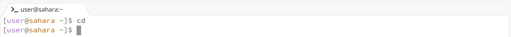
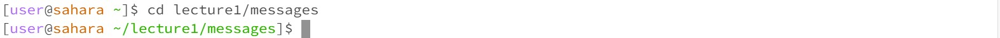
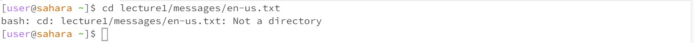
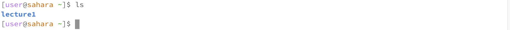
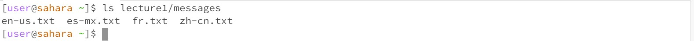
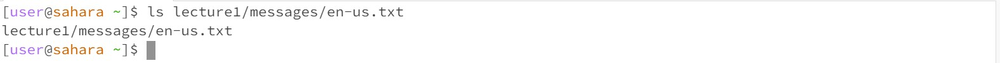
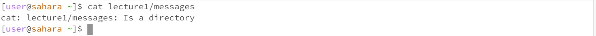
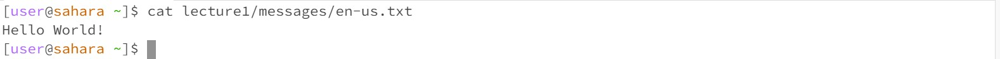

The working directory was `/home`.
No path was given as an input, so the working directory remains the same with no output given. The output is not an error.

The working directory was originally `/home` but changed to `/home/lecture1/messages`.
A path was given as an input, so the working directory changed to the path of the directory given. The output is not an error.

The working directory was `/home`.
A path was given as an input, but the path referred to a file instead of a directory. As a result, an error was given warning that the path refers to a file and not a directory.

The working directory was `/home`.
No input was given, so `ls` printed the name of the only folder within the `/home` directory: lecture1. The output is not an error.

The working directory was `/home`.
A path to a directory was given, so `ls` printed the names of the files within the given directory. The output is not an error.

The working directory was `/home`.
A path to a file was given, so `ls` printed the path to the file name itself because a file cannot holds no files or directories except itself. The output is not an error.

The working directory was `/home`.
No input was given, so cat printed nothing out. There seems to some sort of error as the working directory does not reappear after the command was given.

The working directory was `/home`.
A path to a directory was given, so `cat` returned an error warning that that the path given was a directory and not a file. 

The working directory was `/home`.
A path to a file was given, so `cat` returned the contents of the file as its output. The output is not an error.
