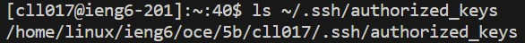

**Part 1**

Code:
```
import java.io.IOException;
import java.net.URI;
import java.util.ArrayList;

class ChatServerHandler implements URLHandler{
    ArrayList<String> messages = new ArrayList<String>();
    public String handleRequest(URI url) {
        if (url.getPath().equals("/add-message")){
            String[] parameters = url.getQuery().split("&");
            String message = parameters[1].substring(2)+": "+parameters[0].substring(5)+"\n";
            messages.add(message);
        }
        String output = "";
        for (String m:messages){
            output += m+"\n";
        }
        return output;
    }
}
class ChatServer{
    public static void main(String[] args) throws IOException {
        if(args.length == 0){
            System.out.println("Missing port number! Try any number between 1024 to 49151");
            return;
        }

        int port = Integer.parseInt(args[0]);

        Server.start(port, new ChatServerHandler());
    }
}
```

Output:


    Methods in my code that are called are `main` method in `ChatServer` class and `handleRequest` method in `ChatServerHandler` class.
    The argument given to `main` is the port number 4000 which is assigned to the field `port`. The argument given to `handleRequest` is the String "s=hello&user=clayl". Fields found in `handleRequest` are `messages` (a list that holds all the messages given to the web server), `parameters` (a list that holds the queries after splitting the String argument), `message` (String which puts the message in terms of user: message), and `output` (a String that holds all the messages in `messages`).
    All fields do not change after being initialized, except `messages` which gets String "clayl: hello" appended to it and `output` which gets changed from being an empty String to being one that holds "clayl: hello".


    Methods in my code that are called are `main` method in `ChatServer` class and `handleRequest` method in `ChatServerHandler` class.
    The argument given to `main` is the port number 4000 which is assigned to the field `port`. The argument given to `handleRequest` is the String "s=hello,clayl&user=clayl2". 
    All fields do not change from the previous output, except `messages` which gets String "clayl2: hello,clayl" appended to it and `output` which gets changed from being an empty String to being one that holds "clayl: hello\nclayl2: hello,clayl\n".


**Part 2**

Output:

Private Key:
The absolute path to the private key for SSH key for logging into ieng6 (on my computer)


Public Key:
The absolute path to the public key for the SSH key for logging into ieng6



Terminal Interaction:
A terminal interaction where I log into my ieng6 account without being asked for a password.


**Part 3**

During the labs in week 2 and week 3 I learned about creating web servers and learning how to run them. I learned the backend of creating web servers through creating java classes that take in the URL link and are able to execute functions/commands through taking in the path and query. I also learned about running web servers through creating a port for the server to run on.
