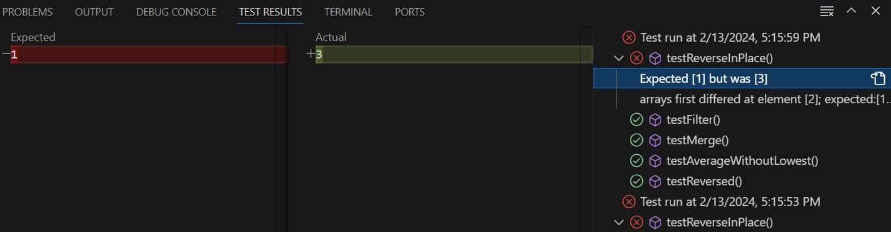
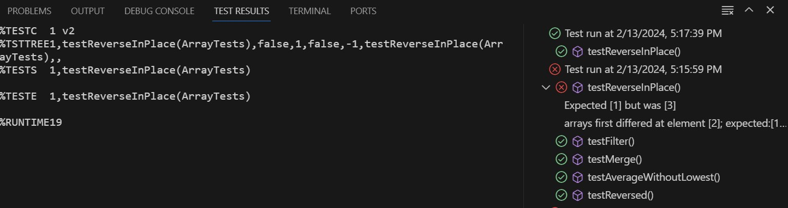
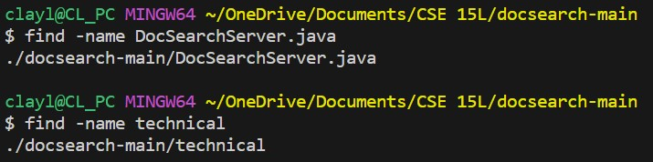
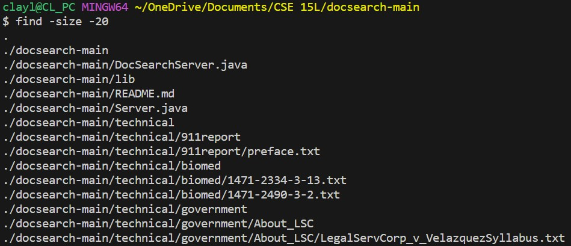
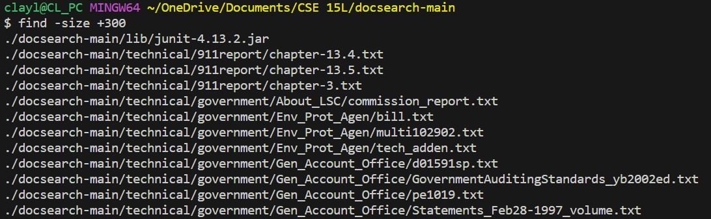
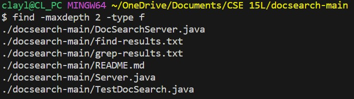
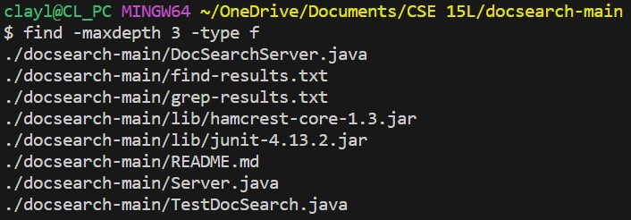
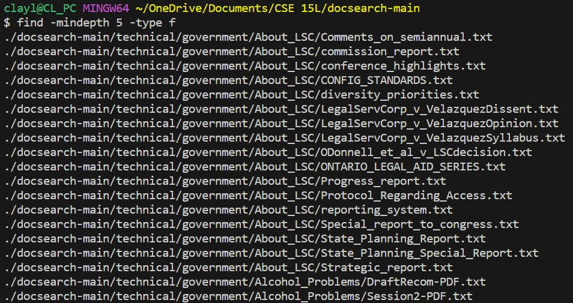
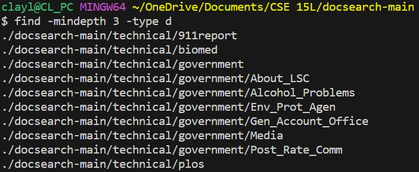

**Part 1**

Failure Inducing Input:
```
@Test 
public void testReverseInPlace() {
  int[] input1 = { 3 4 5 };
  ArrayExamples.reverseInPlace(input1);
  assertArrayEquals(new int[]{ 3 }, input1);
}
```

Non-failure Inducing Input:
```
@Test 
public void testReverseInPlace() {
  int[] input1 = { 3 };
  ArrayExamples.reverseInPlace(input1);
  assertArrayEquals(new int[]{ 3 }, input1);
}
```

Symptom: Before



Symptom: After



Bug: Before
```
static void reverseInPlace(int[] arr) {
  for(int i = 0; i < arr.length; i += 1) {
    arr[i] = arr[arr.length - i - 1];
    }
}
```

Bug: After
```
static void reverseInPlace(int[] arr) {
  int[] copyArr = arr.clone();
  for(int i = 0; i < arr.length; i += 1) {
    arr[i] = copyArr[arr.length - i - 1];
  }
}
```

The fix involves fixing the issue of `reverseInPlace` mirroring the back half of the original array due to the `reverseInPlace` calling elements within the array and changing elements of the same array. By creating a clone of the original array and changing the original array based on the indexes of the cloned and not the original array, the method no longer has the problem.

**Part 2**

Command: `find`

Command-Line Argument 1: `-name`



`-name` is used to help find any files/directories that matches the argument given which if useful if we need to find a specific file/directory.

Command-Line Argument 1: `-size`





`size` is used in order to find files that meet the minimum or maximum character requirement. This can be useful if we want to find files that contain a certain number of characters to find the smaller files and larger files within a directory.

Command-Line Argument 1: `-maxdepth`





`-maxdepth` is used to find any files/directories with a maximum search depth. This can help to prevent the find command from searching too deep into a directory which will reduce search runtime.

Command-Line Argument 1: `-mindepth`





`-mindepth` is the opposite of `-maxdepth` and is used to find any files/directories with a minimum search depth. This is best used if we want to find a file/directory that is buried within multiple directories.
