**Lab Report 4**

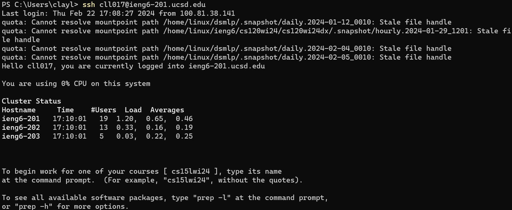

Keys Pressed: `ssh cll017@ieng6-201.ucsd.edu`, `<Enter>`

Used `ssh` command to log into UCSD 201 server (did ieng6-201 because ieng6 would have entered me into the buggy 203 server)

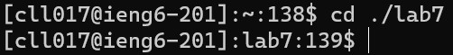

Keys Pressed: `cd ./lab7`, `<Enter>`

Changed the working direction to `lab7`.

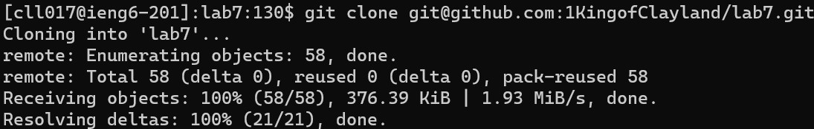

Keys Pressed: `<Ctrl>+<v>`, `<Enter>`

Cloning the github files into the working directory `lab7`.

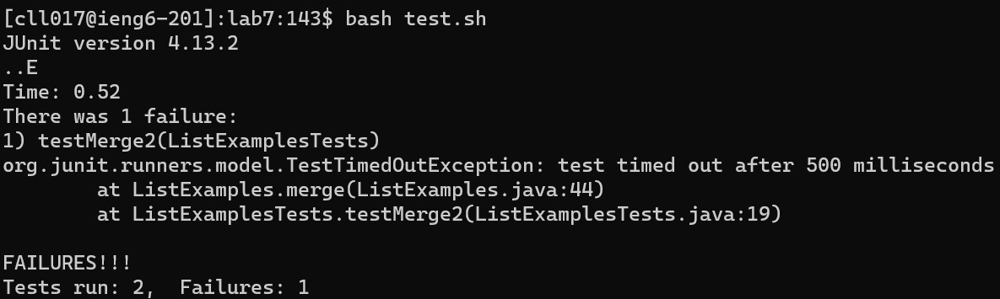

Keys Pressed: `bash `, `t<Tab>`, `<Enter>`

Running test.sh which runs the tests in `ListExamplesTests.java` on `ListExamples.java`. `t<Tab>` is used so I do not need to write out the entire file name.

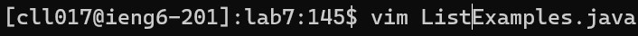

Keys Pressed: `vim `, `ListExamples.<Tab>`, `<Enter>`

Entering vim workspace on file `ListExamples.java`. `ListExamples<Tab>` is used so I do not need to write the entire file name.

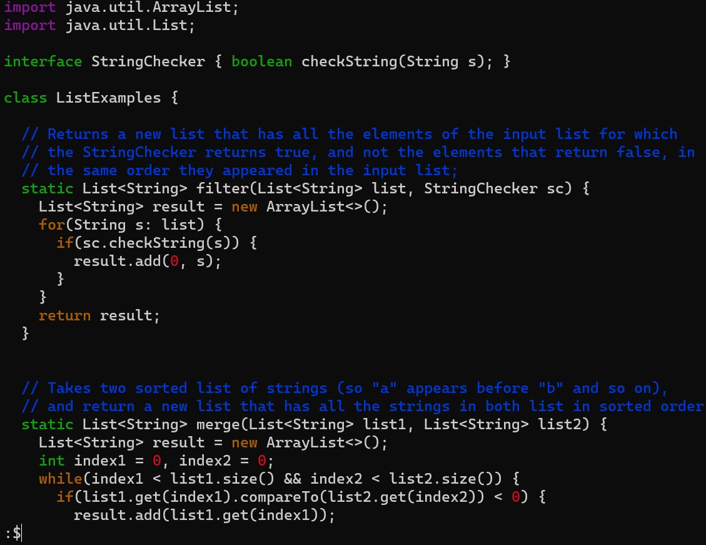

Keys Pressed: `:$`, `<Enter>`

Moves cursor to the end of the file.

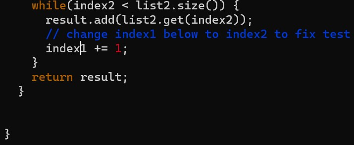

Keys Pressed: `<up><up><up><up><up><up>`, `e`, `x`

Moving cursor up to the correct line number, then moving to the end of the first word "index1". Finally deleting the last character "1".

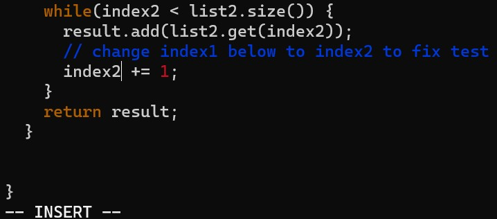

Keys Pressed: `i`, `2`, `<Esc>`

Moving into insert mode in order to add character "2" to "index", then `<Esc>` in order to exit insert mode back to normal mode.

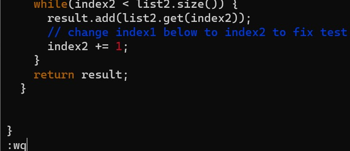

Keys Pressed: `:wq`, `<Enter>`

Save the changes on `ListExamples.java` and quit the vim workspace.

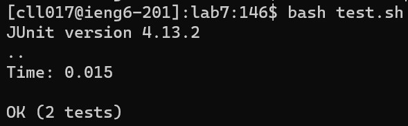

Keys Pressed: `<up><up>`, `<Enter>`

Rurunning the tests on `ListExamplesTest.java` to ensure class `ListExamples` is working correctly.

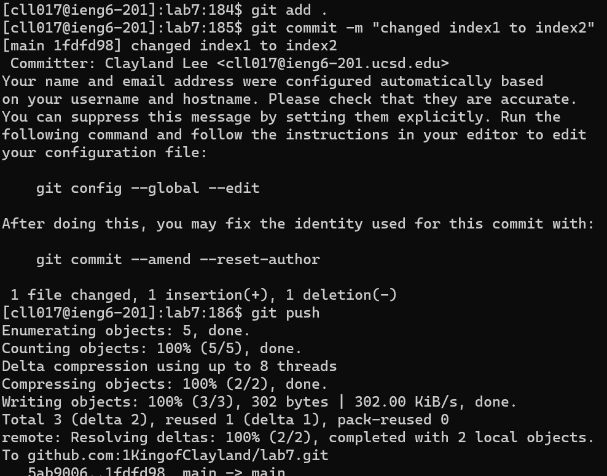

Keys Pressed: `git add .`, `git commit -m 'changed index1 to index2'`, `git push`

Adding the files to be prepared to commited to github. Then creating a commit message for the changes made to the file `ListExamples.java`. Finally, pushing the changes to the github.
