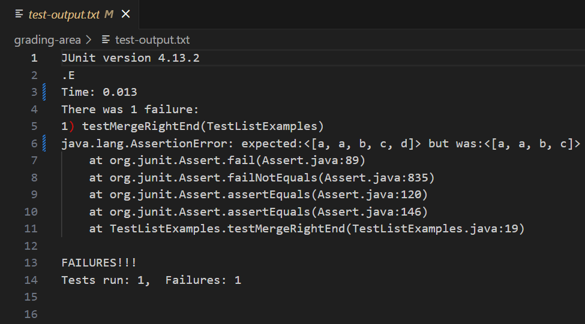
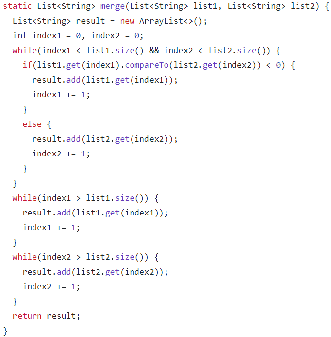
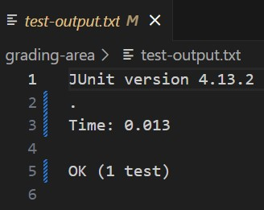
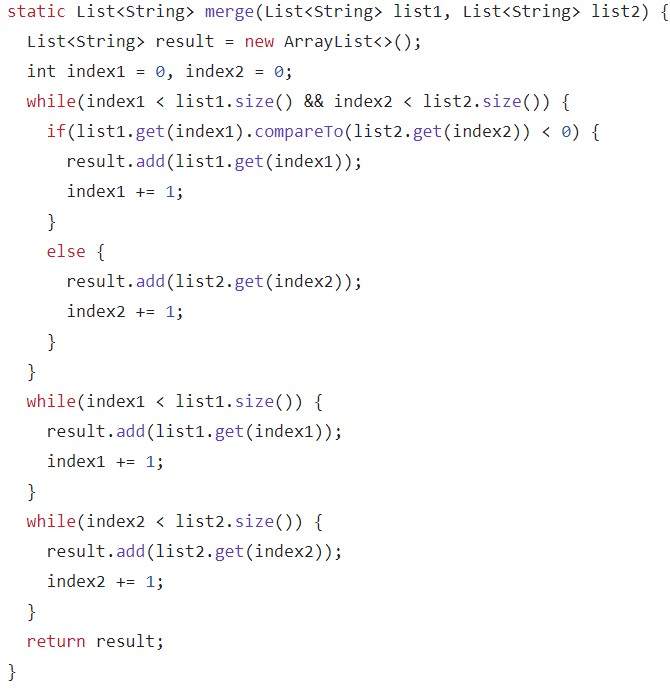

# Lab Report 5

## Part 1
### Original Post

I am getting an error in my code where "d" is not added as an element of `result` for one of my tests where `list1` is `["a","b","c"]` and `list2` is `["a","d"]`. This likely has something to do with how `index2` is incremented in one of the while loops because of the differing lengths of `list1` and `list2`.

### TA Response
Could you possibly explain when the `index1` and `index2` should be incremented? For example if `index1` has reached its max value, how should `index2` be incremented in order to reach its max value. 

### Result

I realized when looking back at my code that there was an error to how `index1` and `index2` is incremented after one of them has reached its max value. The ">" sign in both while loops should be changed to a "<". The change of this sign allows the `index1` and `index2` to correctly increment and ensure the insertion of remaining elements in either `list1` or `list2` into `result`.

### Setup Information
I used the setup from the week 6 lab. For the bugged ListExamples.java: .

The rest of the file contents are the same as the files found in: .

- grading-area
  - ListExamples.java
  - TestListExamples.java
  - test-output.txt
- lib
- student-submission
  - ListExamples.java
- grade.sh
- GradeServer.java
- Server.java
- TestListExamples.java

The full command line used to run the bugged code is: `bash grade.sh https://github.com/1KingofClayland/list-methods-corrected`.

The change required to fix the bug was to change the ">" sign in the last two while loops to "<" in order to ensure `index1` and `index2` incremented correctly after the first while loop had completed.

## Part 2

Something I learned the second part of the quarter was the implementation of a grading script. I learned how to create the bash script required in order to take the files from the student submission and check for components of student submission (i.e. missing files/folders). Furthermore, I learned how to use junit within the grading script in order to grade the student submission and give a score.
